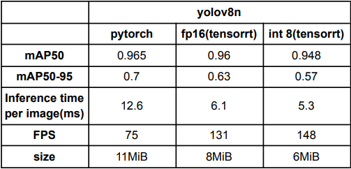

# Weed Detection With YOLOV8n Optimization and Quantization

### This is the implementation for detecting weeds on the grass or any farm using Yolov8n and it's optimized variants

### install the requirements

``` shell
git clone https://github.com/Surya-Sriramoju/Weed-Detection-with-Yolov8n-Optimization.git
cd Weed-Detection-with-Yolov8n-Optimization
pip install -r requirements.txt
```

### To train the model

``` shell
python train.py
```
- make sure to prepare your  dataset in coco data format
- link to the dataset: https://universe.roboflow.com/boris-boiarskii/weeds-rkmym/dataset/1

### To export the model to tensorrt engine

``` shell
python3 export_to_tensorrt.py --model 'model/yolov8n.pt' --q int8 --data='datasets/coco.yaml' --workspace 4 --batch 1
```

### to run the inference
Please make sure to change the path of your own video file
``` shell
python3 run_video.py --model 'model/yolov8n.onnx' --q fp16
```

### Results
#### Inference
int8 Quantization            |fp16 Quantization
:-------------------------:|:-------------------------:
  |  

#### Metrics
Comparison           | 
:-------------------------:|
 |


